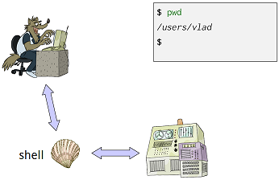
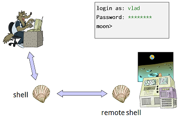
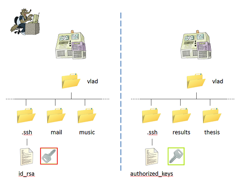

[^1]: [Working Remotely](https://swcarpentry.github.io/shell-extras/02-ssh.html), 소프트웨어 카펜트리 중급 교육자료 번역 

> ## 학습 목표 {.objectives}
>
> *   원격으로 컴퓨터에 접속한다.
> *   시큐어 쉘(SSH)을 사용한다.
> *   공개 열쇠 암호화를 사용하여 원격 컴퓨터에 접속한다.
> *   추가 보안 설정을 수행하고, 다수 컴퓨터에 접속한다.

일반 PC와 노트북 컴퓨터를 사용할 때 무슨 일이 발생하는지 좀더 자세히 살펴보자.
첫번째 단계는 컴퓨터에 로그인(login)한다. 그러면 운영체계(Operating System, OS)가 사용자가 누구인지 확인하고 무슨 작업을 허락할 것이지 준비한다.
사용자 이름과 비밀번호를 입력해서 상기 작업을 수행한다; 운영체제가 시스템 레코드 값을 확인하고, 만약 일치한다면 사용자를 위해 쉘(Shell)을 실행한다.

명령어를 타이핑할 때, 타이핑하는 문자를 표현하는 0과 1이 키보드에서 쉘로 전송된다. 쉘은 화면에 사용자가 타이핑하는 것을 화면에 출력한다. 그리고 나서, 만약 타이핑한 것이 명령어라면, 쉘이 실행을 하고 나서 (출력 결과가 있다면) 산출결과를 화면에 출력한다.

실험결과 데이터베이스를 관리하는 지하실 서버같은 또다른 컴퓨터에 명령어를 실행하고자 한다면 어떨까? 이를 위해서, 먼저 해당 컴퓨터에 로그인해야 한다.
이를 **원격 로그인(remote login)**이라고 부르고, 해당 컴퓨터를 **원격 컴퓨터(remote machine)**라고 한다.
원격 로그인하게 되면, 타이핑하는 모든 것은 원격 컴퓨터에서 실행되고 있는 쉘에 전달된다. 쉘과 상호작용(interact)하면 마치 로컬 컴퓨터 쉘과 마찬가지로 명령어를 실행하게 된다. 그러고 나면, 로컬 컴퓨터 화면에 출력결과를 표시해준다.

원격 로그인하는데 사용하는 도구가 **시큐어 쉘(secure shell, SSH)**이다. 특히, 
`ssh username@computer` 명령어는 SSH를 실행하고 사용자가 지정한 원격 컴퓨터에 접속한다.
로그인한 후에는 원격쉘을 사용해서 원격 컴퓨터에 있는 파일과 디렉토리를 사용한다. `exit`을 타이핑하거나 컨트롤+D(`CTRL+D`)를 누르게 되면, 원격 쉘을 종료하고 이전 쉘로 돌아온다. 
다음 예제에서, 원격쉘과 상호작용이 나타나 있다. 또한, `$` 대신에 원격 컴퓨터 명령 프롬프트가 `moon>`임을 볼 수 있고 Vlad가 비밀번호를 기억하려고 몇번 시도한 것도 나타나 있다.

~~~ {.input}
$ pwd
/users/vlad

$ ssh vlad@moon
Password: ***
Access denied
Password: ********
moon> pwd
/home/vlad
moon> ls -F
bin/     cheese.txt   dark_side/   rocks.cfg
moon> exit

$ pwd
/users/vlad
~~~

시큐어쉘은 이전 `rsh`로 불리는 프로그램과 대조되게 "시큐어(secure)"로 불린다. 옛날에 모든 사람이 서로를 신뢰했고 이름만으로 컴퓨터에 있는 모든 정보를 알고 있었을 때, 네트워크를 통해서 전송할 때 가장 민감한 정보를 제외하고 어떤것도 암호화하지 않았다. 하지만, 이와 같은 방식이 의미하는 것이 악한이 네트워크 통신을 지켜볼 수 있고, 사용자 이름과 비밀번호를 훔칠 수도 있고, 악의적인 방식으로도 사용할 수 있다는 것이다.
SSH가 발명되어 이런 부정적인 면을 방지하거나 적어도 늦출 수도 있다.
SSH는 몇가지 정교하며 오랜 기간 테스트된 암화화 프로토콜을 사용해서 외부인이 서로다른 두 컴퓨터 사이에 오고가는 메시지 내용을 볼 수 없게 확실히 한다.
[다음 장](security.html)에서 SSH가 동작하는 방식을 논하고 실제로 얼마나 보안이 좋은지 살펴본다. 

`ssh`는 `scp`라는 짝꿍 프로그램이 있는데 "보안 복사(Secure Copy)"를 표현하는 명령어다. SSH와 동일한 유형의 네트워크 연결을 사용해서, 
원격 컴퓨터로 혹은 원격 컴퓨터로부터 파일을 복사할 수 있게 한다.
구문(syntax)은 `cp`와 `ssh`를 섞은 것이다.
파일을 복사하기 위해서, 원천(source)과 목표(destination) 경로를 지정하는데 컴퓨터 이름을 포함할 수도 있다. 만약 컴퓨터 이름을 생략하면, 
`ssh`는 지금 실행되고 있는 컴퓨터를 의미한다고 가정한다.
예를 들어, 다음 명령어는 가장 최근 실험결과 (results.dat)를 지하실 백업서버에 복사한다. 복사할 때, 진행경과가 화면에 출력된다.

~~~ {.input}
$ scp results.dat vlad@backupserver:backups/results-2011-11-11.dat
Password: ********
results.dat              100%  9  1.0 MB/s 00:00
~~~

전체 디렉토리를 복사하는 것도 유사하다: `-r` 옵션을 사용해서 복사를 재귀적으로 수행하고 싶다고 신호를 전달하면 된다.
예를 들어, 다음 명령어는 백업 서버에서 모든 작업결과물을 사용자 노트북으로 복사한다. 

~~~ {.input}
$ scp -r vlad@backupserver:backups ./backups
Password: ********
results-2011-09-18.dat              100%  7  1.0 MB/s 00:00
results-2011-10-04.dat              100%  9  1.0 MB/s 00:00
results-2011-10-28.dat              100%  8  1.0 MB/s 00:00
results-2011-11-11.dat              100%  9  1.0 MB/s 00:00
~~~

이제 백업서버에 `backups/results-2011-11-12.dat` 파일을 이미 생성했는지 확인하고자 한다고 가정하자. 
로그인하고 난 다음에 `ls`를 타이핑하는 대신에 다음과 같이 동일한 것을 수행한다.

~~~ {.input}
$ ssh vlad@backupserver ls results
Password: ********
results-2011-09-18.dat  results-2011-10-28.dat
results-2011-10-04.dat  results-2011-11-11.dat
~~~

SSH는 사용자 이름과 실행하려고 하는 컴퓨터 이름 뒤에 인자를 받아서 원격 컴퓨터에 있는 쉘에 명령어를 전달한다. 상기 전달 인자가 적합한 명령어이기 때문에, 원격 쉘이 사용자를 대신해서 `ls results`을 실행하고 실행결과를 다시 로컬 쉘에 화면출력한다.

### 열쇠(키) 생성과 관리 

원격 컴퓨터에 접속할 때마다 비밀번호를 매번 타이핑하는 것은 사소한 성가심 이상이다. 만약 원격 컴퓨터에 세가지 다른 매개변수 조합을 갖는 프로그램을 실행하고자 한다면 무슨 일이 발생할지 상상해보라.
다음과 같은 것을 수행하고자 한다.

~~~ {.input}
for density in {20..29}
do
  for viscosity in 0.70 0.71 0.72 0.73 0.74
  do
    for temperature in 0.001 0.002 0.003 0.004 0.005
    do
      ssh vlad@fastmachine ./simulation -x -d $density -v $viscosity -v $temperature
    done
  done
done
~~~

하지만, 상기 작업을 사실상 수행하고자 한다면, 자리에 앉아서 키보드로 비밀번호를 250번 타이핑해야 할 것이다.
원하는 바는 자동으로 원격 컴퓨터에 인증하는 방법을 찾는 것이다.

[공개 열쇠 암호화(public key cryptography)](gloss.html#public-key-cryptography) 방식에서 가져온 기술을 사용해서 상기 문제를 해결할 수 있다. 좀더 구체적으로, [공개 열쇠(public key)](gloss.html#public-key)와 [개인 열쇠 (private key)](gloss.html#private-key)로 구성된 
[열쇠 쌍(key pair)](gloss.html#key-pair)을 생성한다. 이렇게 생성된 열쇠는 두가지 흥미로운 특성이 있다:

1.  어느 한 열쇠가 암호화한 것은 다른 열쇠가 암호를 풀 수 있다. 예를 들어, 만약 개인 열쇠로 비밀번호를 암호화했다면, 해당 공개 열쇠만 암호를 풀 수 있다. 만약 공개 열쇠로 파일 내용을 암호화했다면, 상응하는 개인 열쇠만 암호를 풀 수 있다. 
2.  한 열쇠가 주어진 상태에서, 다른 열쇠를 찾는 것은 실질적으로 불가능하다. 여기서 "실질적으로 불가능"하다는 의미는 "우리가 마음속으로 상상하는 어떤 컴퓨터를 사용해서 우주 기대수명내에 풀 수는 없다"는 것이다.
(하지만, 양자컴퓨팅이 하루만에 이것을 바꿀 수도 있다-자세한 내용은 근처 다소 몽상적인 물리학자와 상의하세요.)

열쇠쌍을 생성하게 되면, 접속하려는 원격 컴퓨터에 공개 열쇠를 저장하고, 
로컬 컴퓨터에 개인 열쇠를 보관한다. 
SSH는 열쇠가 예상하는 곳에 놓기만 하면, 비밀번호를 묻는 대신에 열쇠를 사용한다.

첫번째 단계는 열쇠쌍을 생성하는 것인데, `ssh-keygen`을 사용해서 열쇠쌍을 생성한다.

~~~ {.input}
$ ssh-keygen -t rsa
Generating public/private rsa key pair.
Enter file in which to save the key (/users/vlad/.ssh/id_rsa): ↵
Enter passphrase (empty for no passphrase): ↵
Your identification has been saved in /users/vlad/.ssh/id_rsa.
Your public key has been saved in /users/vlad/.ssh/id_rsa.pub.
The key fingerprint is: d3:1a:27:38:aa:54:e8:a5:03:db:79:2f:b2:c3:c9:3d
~~~

`-t rsa` 옵션은 `ssh-keygen`에게 RSA키 열쇠를 생성하게 한다; 다른 유형도 있지만, 가장 흔하게 사용되는 것이다. 
"↵" 문자는 복귀(carriage return, CR) 문자다: 기본설정된 디폴트 장소에 열쇠를 저장한다는 것으로 SSH가 열쇠를 어디서 찾는지 알게 되고, 패스프레이즈(passphrase)도 원하지 않는다(패스프레이즈를 원치 않는 이유는 패스워드를 타이핑하지 않고 로그인하는 것이 요점이기 때문이다). 그래서, 두 질문에 단지 엔터만 치게된다.  

홈 디렉토리 아래 `.ssh` 디렉토리 내부를 살펴보자.

~~~ {.input}
$ cd
$ ls .ssh
id_rsa  id_rsa.pub
~~~

첫번째 `id_rsa` 파일은 개인 열쇠 정보를 담고 있다.
절대 원격 컴퓨터에 저장하거나, 전자우편으로 전송하거나,
다른 누구와도 공유하지 마라. (타인이 당신을 가장하여 무언가 수행하는 것을 정말 원하지 않는다면) 다른 파일 `id_rsa.pub`은 매칭되는 공개 열쇠 정보를 담고 있다. 이 파일을 복사해서 접속하려는 원격 컴퓨터에 복사한다.

~~~ {.input}
$ scp .ssh/id_rsa.pub vlad@fastmachine:id_rsa.pub
Password: ********
id_rsa.pub              100%  1  1.0 MB/s 00:00
~~~

여전히 비밀번호를 타이핑해야 하는데 이유는 공개 열쇠가 `scp`를 실행할 때 원격 컴퓨터에 올바른 장소에 위치하지 않아서 그렇다.
원격 컴퓨터에 로그인해서 `.ssh` 디렉토리를 거기에 생성해서 문제를 해결해보자.

~~~ {.input}
$ ssh vlad@fastmachine
Password: ********

$ mkdir .ssh
~~~

다음 단계는 공개 열쇠를 `authorized_keys`로 불리는 `.ssh` 디렉토리에 파일로 복사한다:

~~~ {.input}
$ cp id_rsa.pub .ssh/authorized_keys
~~~

마지막 단계는 권한이 적절하게 `.ssh` 와 `authorized_keys`에 설정되었는지 확실히 한다. 이것은 추가적인 보안 안전 조치다:
만약 사용자를 제외한 타인이 읽거나 변경한다면,
SSH는 더 이상 보안이 확실하지 않다고 가정한다. 올바른 권한은 다음과 같다:

*   소유자(Owner)는 `.ssh` 디렉토리에 읽기, 쓰기, 실행 권한을 갖는다.
*   소유자는 `.ssh/authorized_keys`에 대해서 읽기, 쓰기 권한을 갖는다.
*   그밖의 누구도 어떤 권한을 갖지 않는다.

올바른 명령어는 다음과 같다:

~~~ {.input}
$ chmod u=rwx,g=,o= .ssh
$ chmod u=rw,g=,o= .ssh/authorized_keys
~~~

이제 모든 권한 설정이 되었다. 원격쉘에서 빠져나와 모든 것이 정상적으로 동작하는지 살펴보기 위해서 다음 명령어를 실행한다:

~~~ {.input}
$ exit
$ ssh vlad@fastmachine pwd
/home/vlad
~~~

열쇠를 생성하고 설치한 뒤에 두 컴퓨터 모습이 다음에 나와 있다.

이제 매번 비밀번호 인증절차를 거치지 않고 로컬 컴퓨터에서 원격 컴퓨텅에 `ssh` (그리고 `scp`) 명령을 실행할 수 있다.
하지만, 상기 설정은 일방향으로만 동작한다:
원격 컴퓨터 `authorized_keys` 파일에 설치한 공개키가 사용자가 위치한 로컬 컴퓨터에 로그인 할 수 있는 권한을 부여한 것은 *아니다*.
만약 원격 컴퓨터에서 로컬 컴퓨터로 접속하려면, 원격 컴퓨터에서 열쇠쌍을 생성하고 `id_rsa.pub`을 로컬 컴퓨터 `authorized_keys` 파일로 복사한다.

만약 다른 여러대 컴퓨터에 접속하려면 어떨까? 예를 들어,
백업 서버에서 로컬 노트북 컴퓨터로, 데스크탑 PC로, 연구실 컴퓨터로, 혹은 반대로 파일을 복사한다고 가정하자.
이를 처리하기 위해서, 각 컴퓨터에 있는 `id_rsa.pub` 파일을 원격 컴퓨터 
`.ssh/authorized_keys` 파일에 추가한다. 편집기를 사용해서 수행하거나, 혹은 좀더 간단하게 `cat`과 `>>`을 사용해서 한 파일을 다른 파일에 덧붙인다. 

~~~ {.input}
$ scp id_rsa.pub vlad@backupserver
Password: ********

$ ssh vlad@backupserver
Password: ********

$ cat id_rsa.pub >> .ssh/authorized_keys

$ rm id_rsa.pub

$ exit
~~~

### 원격 컴퓨터 접속 사례 : 클라우드 소프트레이어 서버 접속

먼저 윈도 환경 `Git Bash`를 통해서 바로 `ssh-keygen -t rsa` 명령어를 입력해서 공개열쇠와 개인열쇠를 생성한다. 열쇠쌍은 `c:\Users\admin\.ssh\id_rsa`에 생성된다.

~~~ {.input}
$ ssh-keygen -t rsa
Generating public/private rsa key pair.
Enter file in which to save the key (/c/Users/admin/.ssh/id_rsa):
Enter passphrase (empty for no passphrase):
Enter same passphrase again:
Your identification has been saved in /c/Users/admin/.ssh/id_rsa.
Your public key has been saved in /c/Users/admin/.ssh/id_rsa.pub.
The key fingerprint is:
8d:09:...
admin@STATKCLEE
~~~

이제 소프트레이어 가상컴퓨터에 접속한다. 디바이스 목록에서 `rstudio.xwmooc.net` 이름을 갖는 가상컴퓨터의 IP 주소 `169.54.243.36`에 로그인한다. 물론 비밀번호를 입력해야 한다.

~~~ {.input}
$ ssh root@169.54.243.36
The authenticity of host '169.54.243.36 (169.54.243.36)' can't be established.
RSA key fingerprint is df:0f....
Are you sure you want to continue connecting (yes/no)? Y
Please type 'yes' or 'no': yes
Warning: Permanently added '169.54.243.36' (RSA) to the list of known hosts.
root@169.54.243.36's password:
Linux rstudio 2.6.32-374-ec2 #91-Ubuntu SMP Wed Dec 10 11:07:16 UTC 2014 x86_64
GNU/Linux
Ubuntu 10.04.4 LTS

Welcome to Ubuntu!
 * Documentation:  https://help.ubuntu.com/
Last login: Wed Apr 29 02:33:51 2015 from 222.99.61.77
root@rstudio:~#
~~~

로컬 컴퓨터에 있는 `id_rsa.pub` 공개열쇠를 원격 컴퓨터에 복사한다.
복사를 위해서는 `scp` 명령어를 사용해서 원격 컴퓨터에 접속하고 복사 디렉토리로 홈디렉토리(`~`)를 설정한다. `id_rsa.pub` 파일이 원격컴퓨터 홈디렉토리에 복사된 것을 `ls` 명령어를 통해서 확인한다.

~~~ {.input}
$ scp id_rsa.pub root@169.54.243.36:~
root@169.54.243.36's password:
id_rsa.pub                                    100%  397     0.4KB/s   00:00

admin@STATKCLEE /C/Users/admin/.ssh
$ ssh root@169.54.243.36
root@169.54.243.36's password:
Linux rstudio 2.6.32-374-ec2 #91-Ubuntu SMP Wed Dec 10 11:07:16 UTC 2014 x86_64
GNU/Linux
Ubuntu 10.04.4 LTS

Welcome to Ubuntu!
 * Documentation:  https://help.ubuntu.com/
Last login: Fri May 15 02:00:26 2015 from 112.216.243.234
root@rstudio:~# ls
=               rstudio-0.98.1103-i386.deb          rubygems-1.3.7.tgz
id_rsa.pub      rstudio-server-0.98.1103-amd64.deb  rubygems-1.3.7.tgz.1
lesson-example  rubygems-1.3.7                      xwmooc-sc
root@rstudio:~#
~~~

원격 컴퓨터 홈디렉토리 밑에 하위디렉토로 `.ssh`를 생성한다.
`id_rsa.pub` 공개열쇠 파일을 `.ssh/authorized_keys` 파일로 복사한다.
그리고 추가적인 보안 설정을 위해서 `.ssh` 디렉토리와 `authorized_keys` 파일에 권한 설정을 하고 `exit`를 타이핑해서 원격 컴퓨터 접속을 끊는다.

~~~ {.input}
root@rstudio:~# mkdir .ssh
root@rstudio:~# cp id_rsa.pub .ssh/authorized_keys
root@rstudio:~# chmod u=rwx,g=,o= .ssh
root@rstudio:~# chmod u=rw,g=,o= .ssh/authorized_keys
root@rstudio:~# exit
logout
Connection to 169.54.243.36 closed.
~~~

이제 `ssh root@169.54.243.36` 명령어로 원격 컴퓨터에 접속한다. 패스워드를 타이핑 하지 않고 바로 로그인 된다. 마지막으로 `id_rsa.pub` 홈디렉토리에 원격 복사한 공개열쇠 파일을 삭제해서 마무리한다.

~~~ {.input}
admin@STATKCLEE /C/_software-carpentry/xwmooc-sc (reproducible)
$ ssh root@169.54.243.36
Linux rstudio 2.6.32-374-ec2 #91-Ubuntu SMP Wed Dec 10 11:07:16 UTC 2014 x86_64
GNU/Linux
Ubuntu 10.04.4 LTS

Welcome to Ubuntu!
 * Documentation:  https://help.ubuntu.com/
Last login: Fri May 15 02:06:05 2015 from 112.216.243.234
root@rstudio:~# ls
=               rstudio-0.98.1103-i386.deb          rubygems-1.3.7.tgz
id_rsa.pub      rstudio-server-0.98.1103-amd64.deb  rubygems-1.3.7.tgz.1
lesson-example  rubygems-1.3.7                      xwmooc-sc
root@rstudio:~# rm id_rsa.pub
~~~

동일한 방식으로 IP 주소 `169.54.243.37`을 갖는 `shiny.xwmooc.net` 가상 컴퓨터에도 접속해서 비밀번호를 입력하지 않고 접속하도록 한다.

